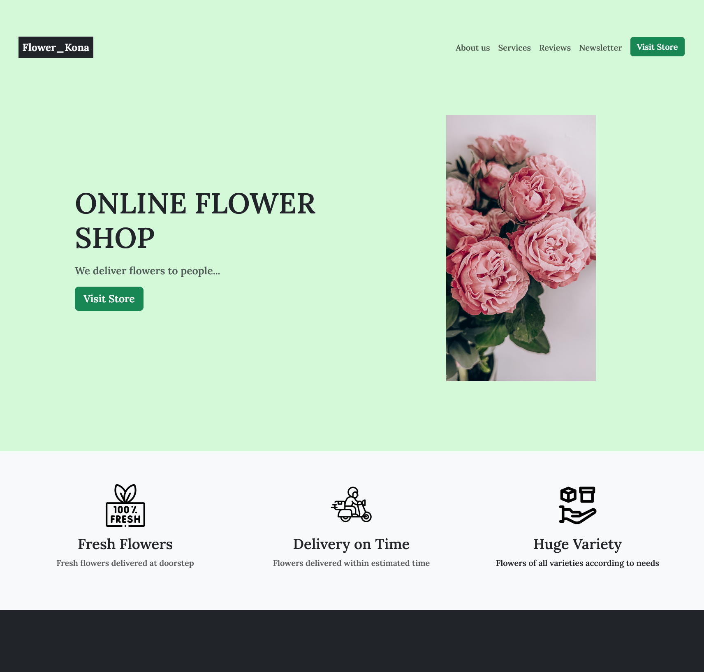

# PORTFOLIO - PROJECT

## LANDING PAGE - FLOWER_KONA

This is a fully responsive landing page of a flower delivery shop. Webpage is designed in figma. Google fonts, font-awesome icons and a CSS framework, Bootstrap is used in making this webpage. You can
visit the live website from the below link: 

## Overview

### Screenshot

### Links

- Live Site URL : [Flower_Kona]()

### Built with

- Semantic HTML5 markup
- CSS custom properties
- Mobile-first workflow
- [Bootstrap](https://getbootstrap.com) - CSS framework
- [Unsplash](https://unsplash.com) - Images
- [Figma](https://www.figma.com) - for designing of webpage

## Author
- Portfolio - [Pradeep Sahu](https://pradeep743.github.io/Portfolio/)

